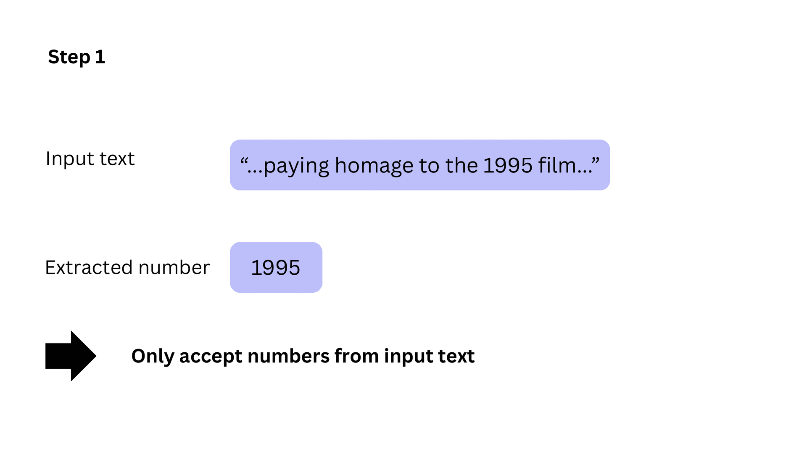
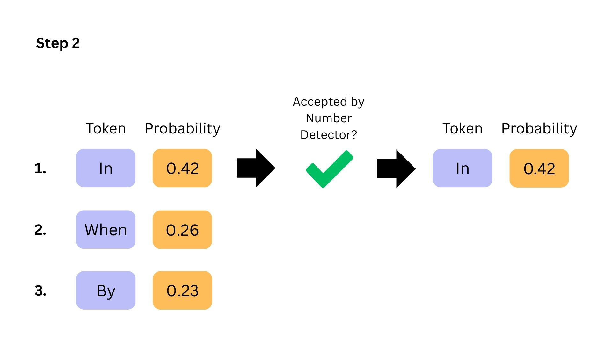
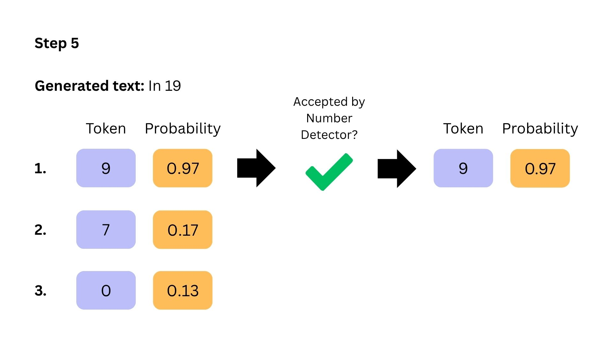

# LettucePrevent 🥬✋
**A real-time hallucination prevention framework to prove new features by experiments**



Scroll to the bottom to see each slide of this GIF.

### Installation
Install all necessary packages via the `requirements.txt` from the repository:
```bash
pip install -r requirements.txt
```

### Execution

```bash
python main.py
```

Currently there are three experiments available:
1. DETECTOR_TYPE 'number'
   - NumberLogitsProcessor() tries to reject all numbers that are not mentioned in the input text
2. DETECTOR_TYPE 'tinylettuce' 
   -  TinyLettuceProcessor() tries to reject all tokens based on the hallucination score of the TinyLettuce model 
   -  Currently Work In Progress!!
3. DETECTOR_TYPE 'none'
   - Default behaviour for language model without any extensions to be able to compare experiment runs

## Experiment Results on Number Detector

All experiments have been executed on a NVIDIA A40 on the 942 unique summary prompts of the RAGTruth dataset.

### Text-Level Hallucinations
- Total number of texts including one or several hallucinated numbers

| Model                    | Plain run | NumberDetector run |
| ------------------------ | --------- | ------------------------- |
| Qwen2.5 14B Instruct     | 46        | 12                        |
| Mistral 7B Instruct v0.2 | 116       | 7                         |
| Llama 7 2B               | 41        | 4                         |

### Total Hallucinations
- Total number of hallucinations


| Model                    | Plain run | NumberDetector run |
| ------------------------ | --------- | ------------------------- |
| Qwen2.5 14B Instruct     | 56        | 14                        |
| Mistral 7B Instruct v0.2 | 141       | 8                         |
| Llama 7 2B               | 47        | 4                         |

### Runtime

| Model               | Plain run [s] | NumberDetector run [s] |
| ------------------- | ------------- | ----------------------------- |
| Qwen2.5 14B Instruct| 9450.35       | 9947.45                       |
| Mistral 7B Instruct | 7630.61       | 8322.47                       |
| Llama 7 2B          | 10093.12      | 10672.77                      |

### Average runtime per generated answer
- Runtime divided by 942 

| Model               | Plain run [s] | NumberDetector run [s] |
| ------------------- | ------------- | ----------------------------- |
| Qwen2.5 14B Instruct| 10.03         | 10.55                         |
| Mistral 7B Instruct | 8.09          | 8.82                          |
| Llama 7 2B          | 10.70         | 11.31                         |

## Slide deck







