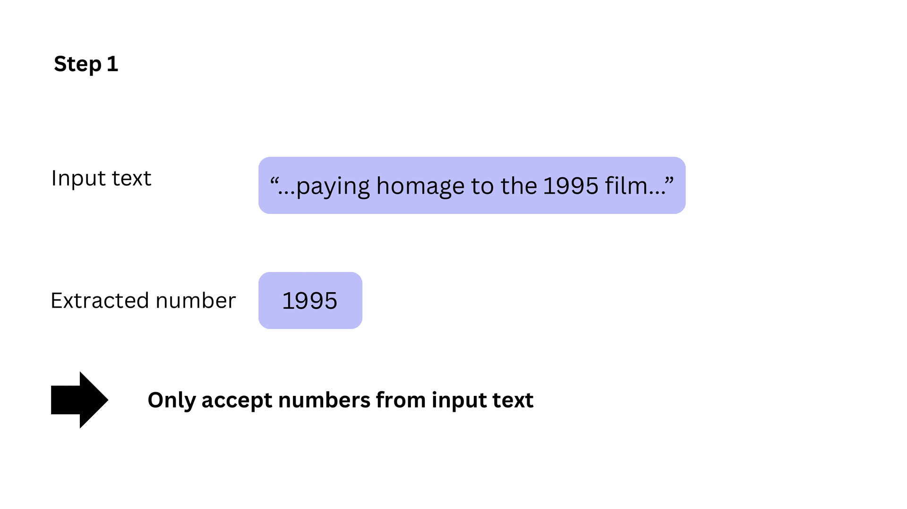
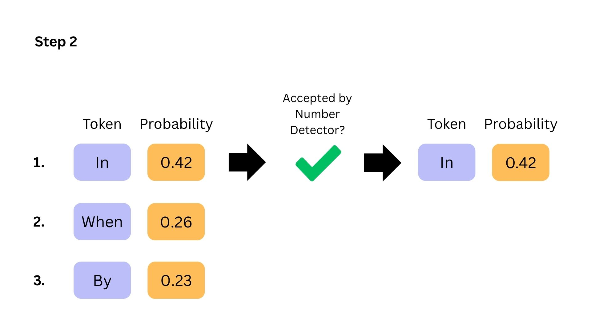
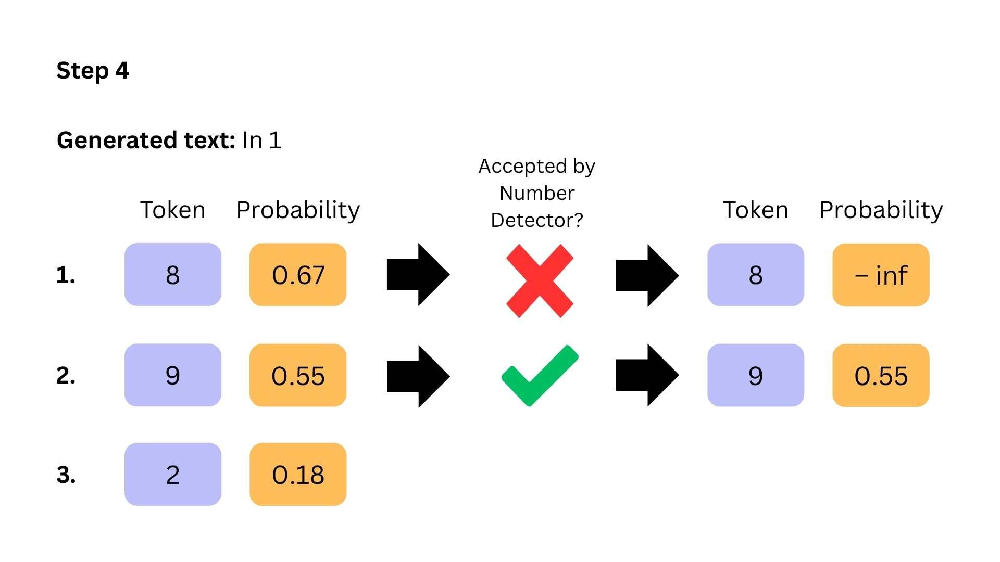
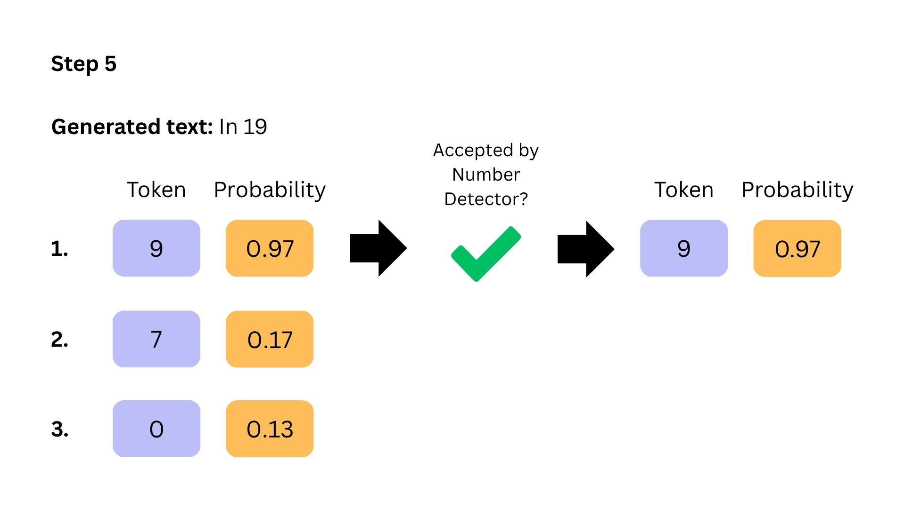
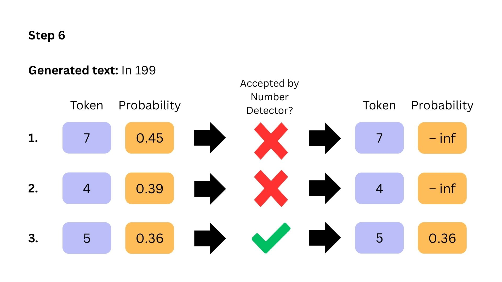

# LettucePrevent 🥬✋
**A real-time hallucination prevention framework to prove new features by experiments**



Scroll to the bottom to see each slide of this GIF.

### Installation
Install all necessary packages via the `requirements.txt` from the repository:
```bash
pip install -r requirements.txt
```

### Execution

```bash
python main.py
```

Currently there are three experiments available:
1. DETECTOR_TYPE 'number'
   - NumberLogitsProcessor() tries to reject all numbers that are not mentioned in the input text
2. DETECTOR_TYPE 'tinylettuce'
   -  TinyLettuceProcessor() tries to reject all tokens identified as a hallucination with a high hallucination score of the TinyLettuce model
3. DETECTOR_TYPE 'none'
   - Default behaviour for language model without any extensions to be able to compare experiment runs

### Configuration Parameters

All parameters are set at the top of `main.py` under the `Configuration` section:

| Parameter | Default | Description |
| --------- | ------- | ----------- |
| `DETECTOR_TYPE` | `'tinylettuce'` | Which detector to use: `'tinylettuce'`, `'number'`, or `'none'` |
| `CONFIDENCE_THRESHOLD` | `0.9` | TinyLettuce only — minimum hallucination confidence score to reject a token |
| `LAST_K_TOKENS_TO_CONSIDER` | `10` | Number of recent tokens used as context window (ignored when `USE_ALL_TOKENS=True`) |
| `TOP_K_LOGITS` | `10` | How many top candidate tokens are checked per generation step |
| `PENALTY_VALUE` | `0` | Score assigned to penalised tokens (use `float('-inf')` to hard-block) |
| `USE_ALL_TOKENS` | `True` | If `True`, use all generated tokens as context instead of only the last `LAST_K_TOKENS_TO_CONSIDER` |
| `LOGITS_SKIP_THRESHOLD` | `0.9` | Skip the hallucination check entirely when the top token's probability exceeds this value |

## Experiment Results on Number Detector

All experiments have been executed on a NVIDIA A40 on the 942 unique summary prompts of the RAGTruth dataset.

### Text-Level Hallucinations
- Total number of texts including one or several hallucinated numbers

| Model                    | Plain run | NumberDetector run |
| ------------------------ | --------- | ------------------------- |
| Qwen2.5 14B Instruct     | 46        | 12                        |
| Mistral 7B Instruct v0.2 | 116       | 7                         |
| Llama 7 2B               | 41        | 4                         |

### Total Hallucinations
- Total number of hallucinations


| Model                    | Plain run | NumberDetector run |
| ------------------------ | --------- | ------------------------- |
| Qwen2.5 14B Instruct     | 56        | 14                        |
| Mistral 7B Instruct v0.2 | 141       | 8                         |
| Llama 7 2B               | 47        | 4                         |

### Runtime

| Model               | Plain run [s] | NumberDetector run [s] |
| ------------------- | ------------- | ----------------------------- |
| Qwen2.5 14B Instruct| 9450.35       | 9947.45                       |
| Mistral 7B Instruct | 7630.61       | 8322.47                       |
| Llama 7 2B          | 10093.12      | 10672.77                      |

### Average runtime per generated answer
- Runtime divided by 942 

| Model               | Plain run [s] | NumberDetector run [s] |
| ------------------- | ------------- | ----------------------------- |
| Qwen2.5 14B Instruct| 10.03         | 10.55                         |
| Mistral 7B Instruct | 8.09          | 8.82                          |
| Llama 7 2B          | 10.70         | 11.31                         |

## Slide deck









